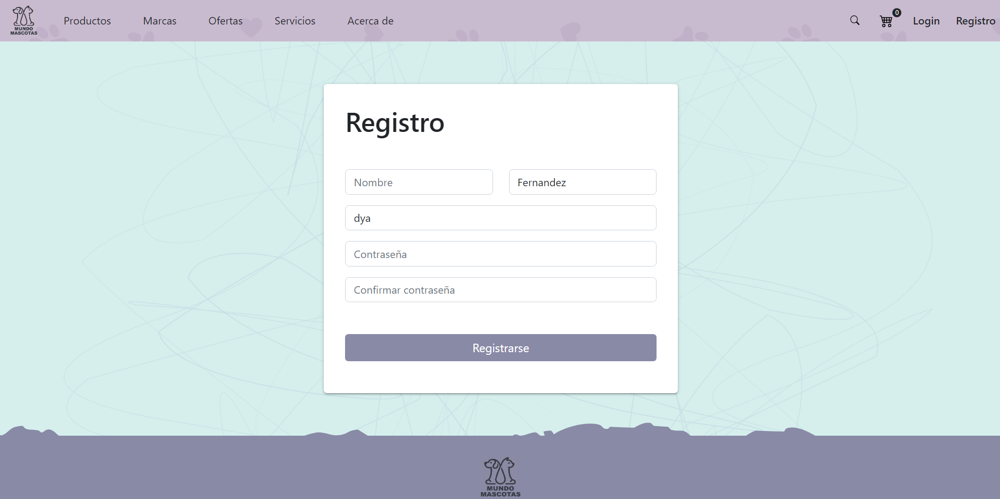
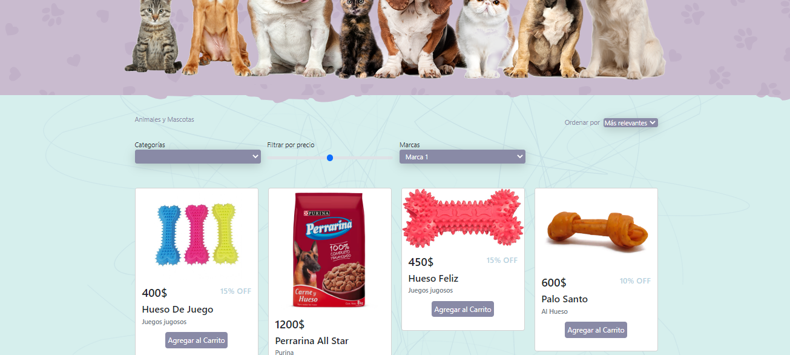
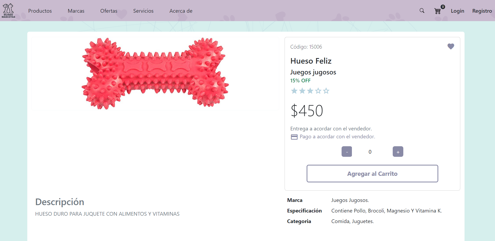
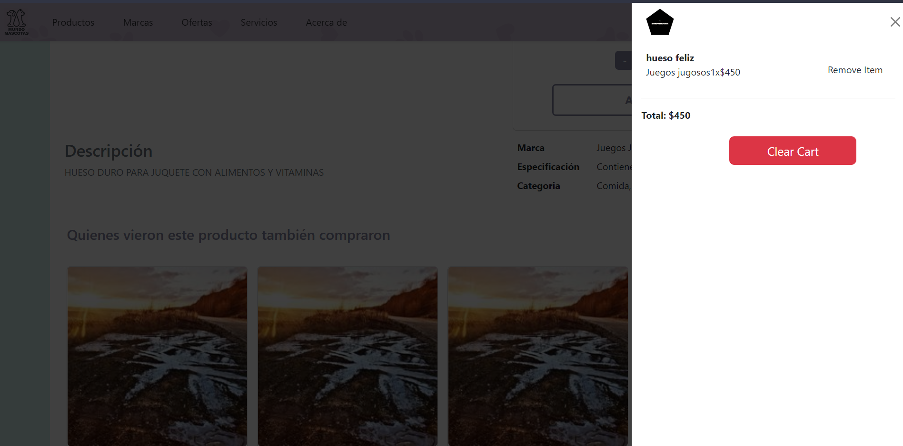
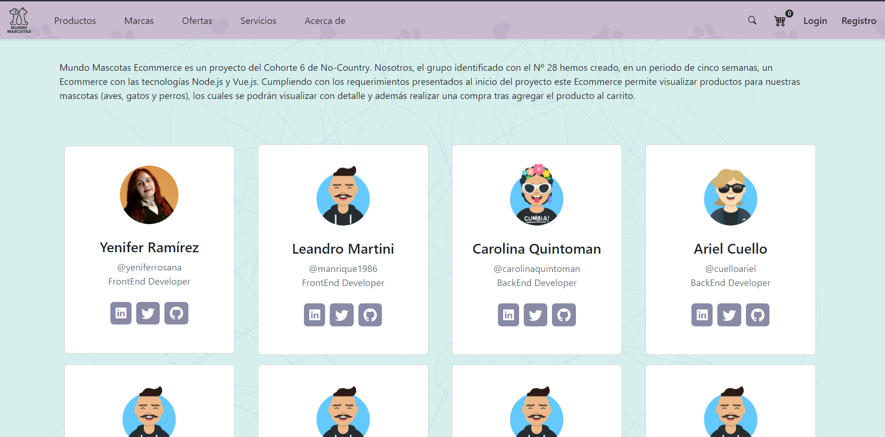
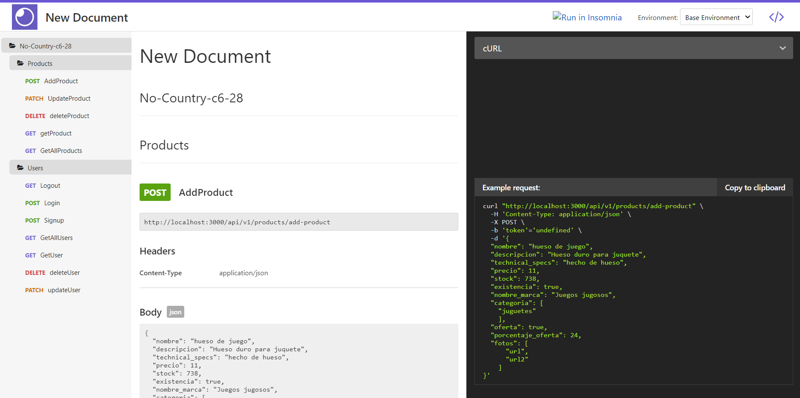
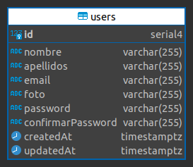
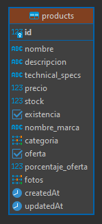

# tienda-mascotas

<!-- PROJECT LOGO -->
 

  

<h3 align="center">Mundo Mascotas</h3>

  

    E-Commerce
     
    <a href="https://radiant-brushlands-22902.herokuapp.com/">Ver Demo</a>
  

<!-- ABOUT THE PROJECT -->
## Sobre el Proyecto

 

Bienvenido a Mundo Mascotas un ecommerce dedicado netamente a mascotas como perros, gatos y aves, donde encontrarás ropas, accesorios, comidas, etc para tus mascotas que tanto quieres y adoras 🤗.

Este proyecto nace de la necesidad de encontrar un buen lugar donde comprar las cosas que necesitamos para nuestras mascotas 🐶y tiene como objetivo tener una manera facil de brindar los productos que ofrecemos.

### Diseño UX/UI

El proyecto lo realizamos y lo logramos con la ausencia de un perfil UX/UI porque la mayoria nos desempeñamos bien como backend o frontend, pero aún asi se logró un buen trabajo gracias al excelente equipo que tenemos, aquí una muestra del diseño inicial que teniamos y que se fue puliendo en cada modificación 👌 [Figma](https://www.figma.com/file/DG9GnIsAu7DzHoGLoJBYSO/Mundo-Mascota?node-id=0%3A1)

### Frontend

Con respecta al frontend el team encargado de ese trabajo es excelente una pasada formar parte de ese grupo, el proyecto en frontend lo tratamos de realizar siguiendo un estilo de código generado por [eslint](https://eslint.org/) y para tener todo formateado utilizamos [prettier](https://prettier.io/docs/en/install.html) y automatizamos el proceso con [husky](https://typicode.github.io/husky/#/) para el precommit y el prepush

Realizamos para cada interfaz un componente y tratamos de desacoplar algunos componentes haciendo micro componentes reutilizables para ahorrar código y tiempo. 

Aqui algunas de las interfaces que realizamos con el equipo de frontend.

  
  
  
  
  

### BackEnd

Por parte del equipo de backend se realizó la configuración para la conexión a la base de datos, el modelado y el codigo referido a manejo de errores, seguridad y endpoints para ser consumidos por el equipo del FronEnd.
#### Documentación
https://c6-28.up.railway.app/

### Modelado de la Base de Datos

## Este proyecto esta desarrollado con

UX/UI

* [Figma](https://www.figma.com/)

Frontend

* [Vue 3](https://vuejs.org/)
* [Bootstrap 5](https://getbootstrap.com/)
* [Vuex](https://vuex.vuejs.org/)
* [prettier](https://prettier.io/docs/en/install.html)
* [eslint](https://eslint.org/)
* [husky](https://typicode.github.io/husky/#/)

Backend

* [Nodejs](https://nodejs.dev/en/)
* [Express](https://expressjs.com/)
* [PostgreSQL](https://www.postgresql.org/)

(<a href="#top">Arriba</a>)

## ROLES DE INTEGRANTES

Frontend 

* Yenifer Ramírez | [github](https://github.com/yeniferrosana) | [Linkedin](https://www.linkedin.com/in/yeniferrosana/)
* Leandro Martini | [github](https://github.com/manrique1986) | [Linkedin](https://www.linkedin.com/in/leandro-martini-developer/)
* Daniel Aguilar | [github](https://github.com/Onnichan) | [Linkedin](https://www.linkedin.com/in/wdanielaguilar/)
* Agustin Prado | [github](https://github.com/subjekt-iv) | [Linkedin](https://www.linkedin.com/in/agust%C3%ADn-prado-64b1371b7/)

Backend 

* Carolina Quintoman | [github](https://github.com/CarolinaQuintoman) | [Linkedin](https://www.linkedin.com/in/carolina-quintoman-037452148)
* Ariel Cuello | [github](https://github.com/cuelloariel) | [Linkedin](https://www.linkedin.com/in/cuello-ariel)
* James Noria | [github](https://github.com/jamesnoria) | [Linkedin](https://www.linkedin.com/in/jamesnoria)
* Mikel Diaz | [github](https://github.com/SBolivarLoL) | [Linkedin](https://www.linkedin.com/mwlite/in/mikel-diaz-velasquez)
* Kevin Huaza | [github](https://github.com/khuaza9612) | [Linkedin](https://www.linkedin.com/in/kevin-huaza-navia-a59b61225)

UX/UI

* Agustin Prado | [github](https://github.com/subjekt-iv) | [Linkedin](https://www.linkedin.com/in/agust%C3%ADn-prado-64b1371b7/)

## Link del deploy y Front

https://radiant-brushlands-22902.herokuapp.com/

(<a href="#top">Arriba</a>)

https://github.com/No-Country/c6-28-vue-node/tree/develop

<!-- ACKNOWLEDGMENTS -->
## Agradecimientos

* [No-Country](https://github.com/No-Country/)

(<a href="#top">Arriba</a>)

<!-- MARKDOWN LINKS & IMAGES -->
<!-- https://www.markdownguide.org/basic-syntax/#reference-style-links -->
[contributors-shield]: https://img.shields.io/github/contributors/github_username/repo_name.svg?style=for-the-badge
[contributors-url]: https://github.com/github_username/repo_name/graphs/contributors
[forks-shield]: https://img.shields.io/github/forks/github_username/repo_name.svg?style=for-the-badge
[forks-url]: https://github.com/github_username/repo_name/network/members
[stars-shield]: https://img.shields.io/github/stars/github_username/repo_name.svg?style=for-the-badge
[stars-url]: https://github.com/github_username/repo_name/stargazers
[issues-shield]: https://img.shields.io/github/issues/github_username/repo_name.svg?style=for-the-badge
[issues-url]: https://github.com/github_username/repo_name/issues
[license-shield]: https://img.shields.io/github/license/github_username/repo_name.svg?style=for-the-badge
[license-url]: https://github.com/github_username/repo_name/blob/master/LICENSE.txt
[linkedin-shield]: https://img.shields.io/badge/-LinkedIn-black.svg?style=for-the-badge&logo=linkedin&colorB=555
[linkedin-url]: https://linkedin.com/in/linkedin_username
[product-screenshot]: images/screenshot.png
